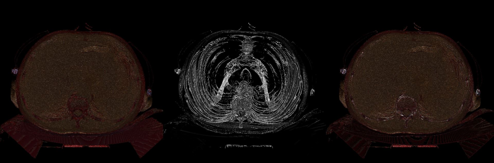
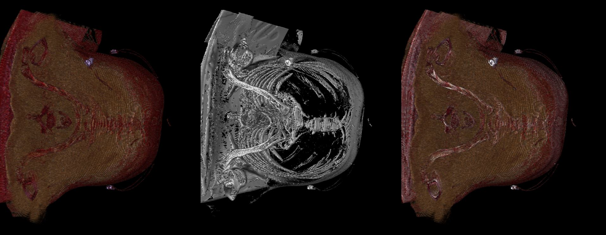
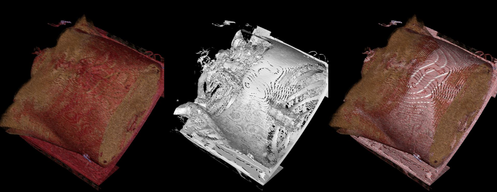

# MM - 804 Assignment 3
## Image description
Name - Lung-PET-CT-Dx

Dimension = 3,37,50,912 bytes

Voxel Resolution = 5 mm

Minimum and maximum pixel intensities = 0 - 255

File size = 3,37,50,912 bytes

## Requirements
vtk==9.1.0
python==3.8.8

## Steps to follow to execute
Download the required packages in your local system with the given command.

pip install -r requirements.txt

Then run python file using command:

python Assignment2.py

## Output
Once the above steps are executed the output obtained is as follows:

